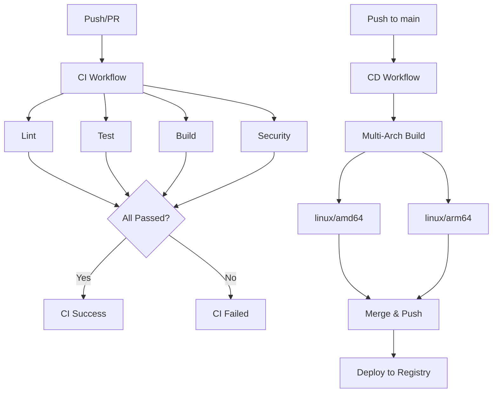

# GitHub Actions CI/CD Documentation

This document describes the complete CI/CD pipeline for the Docker ReactJS Sample project. The pipeline is designed for production use and serves as a reference for "Docker for React.js Developers" book.

## 📋 Table of Contents

- [Overview](#overview)
- [Workflow Architecture](#workflow-architecture)
- [Individual Workflows](#individual-workflows)
- [Setup Instructions](#setup-instructions)
- [Best Practices](#best-practices)
- [Troubleshooting](#troubleshooting)

## Overview

The CI/CD pipeline is split into separate, modular workflows for better maintainability and faster feedback:

| Workflow | Purpose | Trigger |
|----------|---------|---------|
| **lint.yml** | Code quality checks with ESLint | PR, Push, Manual |
| **test.yml** | Unit tests with 100% coverage | PR, Push, Manual |
| **build.yml** | Build and validate Docker images | PR, Push, Manual |
| **security.yml** | Security vulnerability scanning | PR, Push to main, Schedule, Manual |
| **ci.yml** | Orchestrates all CI checks | PR, Push |
| **cd.yml** | Multi-arch deployment to registry | Push to main, Tags, Manual |

## Workflow Architecture



## Individual Workflows

### 1. Lint Workflow (`lint.yml`)

**Purpose:** Ensures code quality and consistency using ESLint.

**Key Features:**
- Uses Docker Compose for consistent linting environment
- Runs ESLint with comprehensive rules
- Fast feedback on code quality issues

**Triggers:**
- Pull requests to main/develop
- Push to main/develop
- Manual dispatch

**Example Run:**
```bash
# Locally test the same way
docker compose build react-lint
docker compose run --rm react-lint
```

**Success Criteria:**
- ✅ All ESLint rules pass
- ✅ No linting errors or warnings

---

### 2. Test Workflow (`test.yml`)

**Purpose:** Runs unit tests with coverage reporting and enforces 100% coverage.

**Key Features:**
- Executes Vitest tests in Docker container
- Generates coverage reports (LCOV, HTML, JSON)
- Uploads coverage to Codecov
- Comments coverage summary on PRs
- Archives coverage artifacts for 30 days

**Triggers:**
- Pull requests to main/develop
- Push to main/develop
- Manual dispatch

**Coverage Reporting:**
- **Statements:** 100%
- **Branches:** 100%
- **Functions:** 100%
- **Lines:** 100%

**Outputs:**
- Coverage artifacts
- PR comments with coverage table
- Codecov integration

**Example Run:**
```bash
# Locally test the same way
docker compose build react-test
docker compose run --rm \
  -v $(pwd)/coverage:/app/coverage \
  react-test
```

---

### 3. Build Workflow (`build.yml`)

**Purpose:** Validates both development and production Docker builds.

**Jobs:**

#### build-dev
- Builds development Docker image
- Starts dev server
- Checks server health
- Verifies accessibility on port 5173
- Waits up to 60 seconds for server startup

#### build-production
- Builds production Docker image with nginx
- Starts production container
- Tests HTTP endpoint (port 8080)
- Verifies static assets
- Checks nginx configuration
- Exports and uploads image artifact

**Triggers:**
- Pull requests to main/develop
- Push to main/develop
- Manual dispatch

**Success Criteria:**
- ✅ Dev server starts and is accessible
- ✅ Production build completes successfully
- ✅ Nginx serves static files correctly
- ✅ HTTP 200 response from production server

**Example Run:**
```bash
# Development
docker compose up -d react-dev
curl http://localhost:5173

# Production
docker compose up -d react-prod
curl http://localhost:8080
```

---

### 4. Security Workflow (`security.yml`)

**Purpose:** Scans Docker images for security vulnerabilities.

**Jobs:**

#### trivy-scan
- Scans for CVEs using Trivy
- Reports CRITICAL, HIGH, and MEDIUM severity issues
- Uploads SARIF results to GitHub Security
- Displays table format in logs

#### scout-scan
- Scans using Docker Scout
- Focuses on critical and high severity CVEs
- Uploads results to GitHub Security

#### dependency-review
- Reviews dependencies for known vulnerabilities
- Only runs on pull requests
- Fails on moderate or higher severity issues

**Triggers:**
- Pull requests to main/develop
- Push to main
- Daily at 2 AM UTC (scheduled)
- Manual dispatch

**Security Standards:**
- Zero CRITICAL vulnerabilities
- Minimal HIGH severity vulnerabilities
- All dependencies reviewed

**Example Run:**
```bash
# Using Trivy locally
docker compose build react-prod
trivy image docker-reactjs-sample

# Using Docker Scout
docker scout cves docker-reactjs-sample
```

---

### 5. CI Workflow (`ci.yml`)

**Purpose:** Orchestrates all continuous integration checks.

**Architecture:**
- Uses **reusable workflows** for modularity
- Runs lint, test, build, and security in parallel
- Final validation step confirms all checks passed

**Benefits:**
- Single workflow to monitor
- Parallel execution for speed
- Clear success/failure status
- Easy to add/remove checks

**Triggers:**
- Pull requests to main/develop
- Push to main/develop

**Success Criteria:**
- ✅ All child workflows (lint, test, build) pass
- ✅ Security checks complete (if applicable)
- ✅ Ready to merge indicator

---

### 6. CD Workflow (`cd.yml`)

**Purpose:** Continuous deployment to container registry with multi-architecture support.

**Jobs:**

#### multi-arch-build
- Builds for linux/amd64 and linux/arm64
- Uses QEMU for cross-platform builds
- Pushes images by digest
- Leverages GitHub Actions cache

#### merge-and-push
- Creates multi-architecture manifest
- Merges platform-specific images
- Tags with version, sha, and latest
- Pushes to GitHub Container Registry (ghcr.io)

**Triggers:**
- Push to main branch
- Version tags (v*.*.*)
- Manual dispatch

**Image Tags:**
```
ghcr.io/user/repo:main
ghcr.io/user/repo:v1.0.0
ghcr.io/user/repo:v1.0
ghcr.io/user/repo:v1
ghcr.io/user/repo:main-sha123456
ghcr.io/user/repo:latest
```

**Permissions Required:**
- `contents: read` - Read repository
- `packages: write` - Push to registry

**Example Deploy:**
```bash
# Pull and run the deployed image
docker pull ghcr.io/user/repo:latest
docker run -p 8080:8080 ghcr.io/user/repo:latest
```

---

## Setup Instructions

### 1. Repository Secrets

Configure these secrets in GitHub repository settings:

```bash
# Optional: For Codecov integration
CODECOV_TOKEN=your-codecov-token
```

### 2. Enable GitHub Container Registry

1. Go to repository Settings → Actions → General
2. Under "Workflow permissions", select:
   - ✅ Read and write permissions
   - ✅ Allow GitHub Actions to create and approve pull requests

### 3. Enable GitHub Security Features

1. Go to Security → Code security and analysis
2. Enable:
   - ✅ Dependency graph
   - ✅ Dependabot alerts
   - ✅ Dependabot security updates
   - ✅ Code scanning (CodeQL)

### 4. Branch Protection Rules

Configure branch protection for `main` and `develop`:

```yaml
Required status checks:
  - Code Quality (lint)
  - Tests & Coverage (test)
  - Build Validation (build)
  - CI Success

Required reviews: 1
Require branches to be up to date: true
Include administrators: true
```

### 5. Test Workflows

Test each workflow locally using Docker Compose:

```bash
# Lint
docker compose run --rm react-lint

# Test
docker compose run --rm react-test

# Dev
docker compose up -d react-dev

# Production
docker compose up -d react-prod
```

---

## Best Practices

### 1. **Modular Workflows**
- Each workflow has a single responsibility
- Easy to test and debug independently
- Can be reused across projects

### 2. **Docker Compose Integration**
- All checks use Docker Compose
- Consistent between local and CI environments
- Easy to reproduce CI failures locally

### 3. **Fast Feedback**
- Workflows run in parallel when possible
- Fail fast on critical errors
- Clear success/failure messages

### 4. **Artifact Management**
- Coverage reports saved for 30 days
- Production images saved for 7 days
- Old artifacts automatically cleaned up

### 5. **Security First**
- Regular security scans
- Dependency review on PRs
- Results published to GitHub Security

### 6. **Multi-Architecture Support**
- Builds for ARM64 and AMD64
- Uses manifest lists for automatic platform selection
- Optimized with build caching

---

## Troubleshooting

### Lint Failures

**Issue:** ESLint errors in CI

**Solution:**
```bash
# Run locally to see errors
npm run lint

# Auto-fix issues
npm run lint:fix
```

### Test Failures

**Issue:** Tests pass locally but fail in CI

**Solution:**
```bash
# Test in Docker (same as CI)
docker compose run --rm react-test

# Check coverage
docker compose run --rm \
  -v $(pwd)/coverage:/app/coverage \
  react-test

# View coverage report
open coverage/index.html
```

### Build Failures

**Issue:** Docker build fails

**Solution:**
```bash
# Build dev image
docker compose build react-dev

# Build prod image
docker compose build react-prod

# Check build logs
docker compose build react-prod --progress=plain
```

### Security Scan Failures

**Issue:** Vulnerabilities detected

**Solution:**
```bash
# Scan locally with Trivy
docker compose build react-prod
trivy image docker-reactjs-sample

# Update dependencies
npm audit fix
npm update

# Rebuild and rescan
docker compose build react-prod
```

### Deployment Failures

**Issue:** CD workflow fails to push

**Solution:**
1. Check GitHub Actions permissions
2. Verify `GITHUB_TOKEN` has `packages: write`
3. Check if registry is accessible
4. Review multi-arch build logs

---

## Monitoring and Maintenance

### Daily Tasks
- ✅ Review security scan results
- ✅ Check dependency updates

### Weekly Tasks
- ✅ Review coverage trends
- ✅ Update dependencies
- ✅ Clean up old artifacts

### Monthly Tasks
- ✅ Review and optimize workflows
- ✅ Update action versions
- ✅ Review security policies

---

## Performance Metrics

### Typical Run Times

| Workflow | Duration | Notes |
|----------|----------|-------|
| Lint | ~1-2 min | Fast feedback |
| Test | ~2-3 min | Includes coverage |
| Build Dev | ~2-3 min | Verifies dev server |
| Build Prod | ~3-4 min | Full build + test |
| Security | ~5-7 min | Comprehensive scans |
| Multi-Arch | ~10-15 min | ARM64 + AMD64 |

### Optimization Tips

1. **Use caching:**
   - Docker layer caching enabled
   - npm cache in Docker builds
   - GitHub Actions cache for dependencies

2. **Parallel execution:**
   - Lint, test, and build run in parallel
   - Multi-arch builds run concurrently

3. **Conditional execution:**
   - Security scans only on main/PRs
   - Multi-arch only on main branch
   - Some checks skip on documentation-only changes

---

## Resources

- [GitHub Actions Documentation](https://docs.github.com/en/actions)
- [Docker Compose Documentation](https://docs.docker.com/compose/)
- [GitHub Container Registry](https://docs.github.com/en/packages/working-with-a-github-packages-registry/working-with-the-container-registry)
- [Trivy Security Scanner](https://aquasecurity.github.io/trivy/)
- [Docker Scout](https://docs.docker.com/scout/)

---

## Support

For issues or questions about the CI/CD pipeline:

1. Check this documentation
2. Review workflow run logs in GitHub Actions
3. Test locally using Docker Compose
4. Open an issue in the repository

---

**Last Updated:** 2025
**Version:** 1.0.0
**Maintainer:** Kristiyan Velkov


